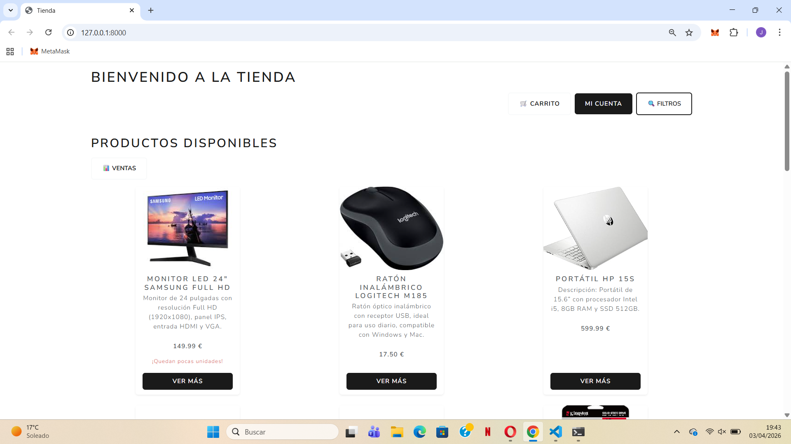
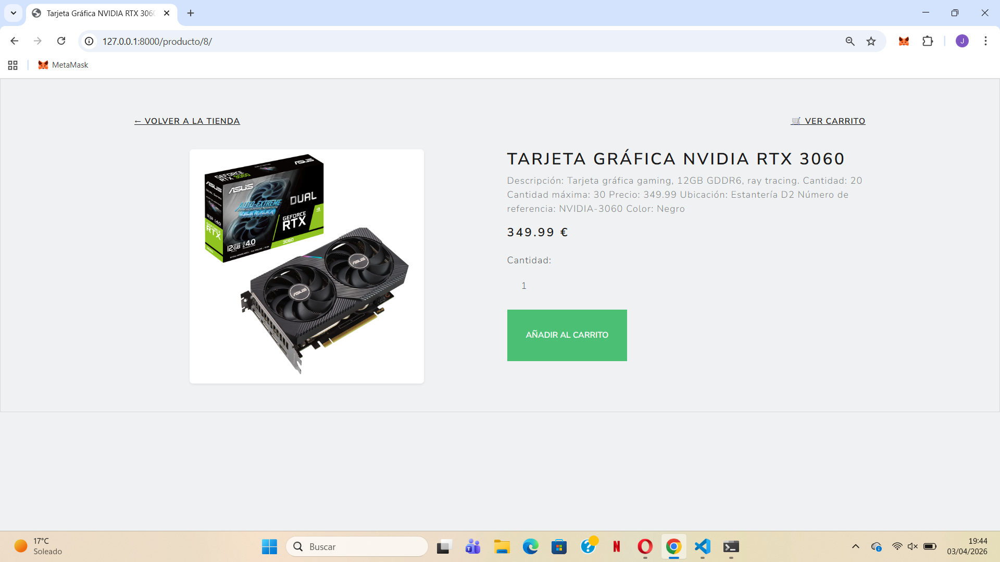
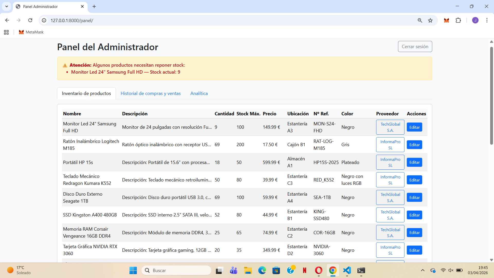
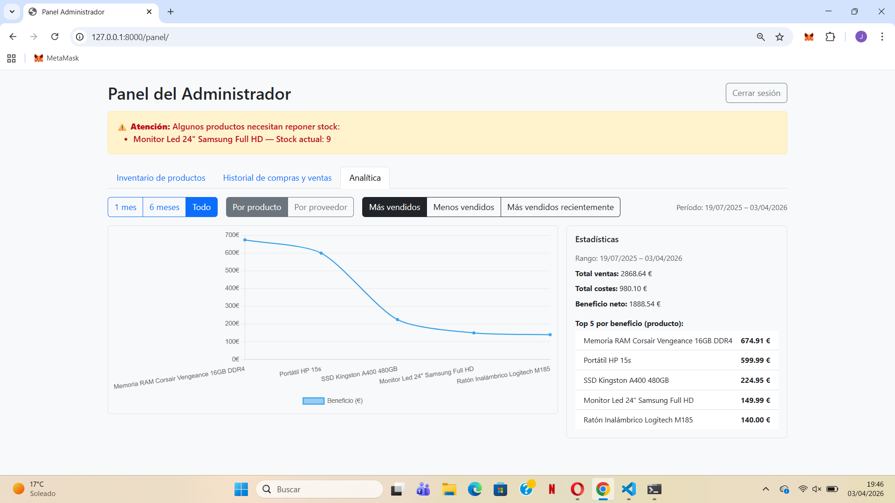
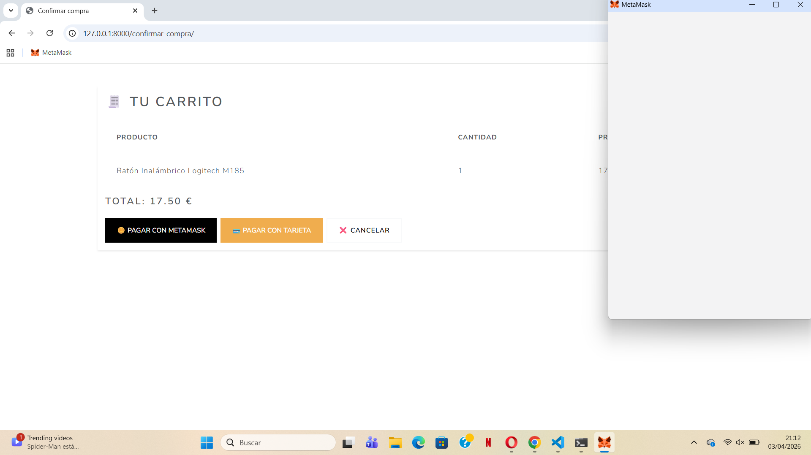

Computer Products E-commerce Platform with Admin Dashboard and Web3 Payments

Full-stack web application for managing and selling computer products, featuring a Python-based backend, advanced administrative dashboard, and MetaMask (Web3) payment integration.

This project demonstrates the ability to develop complete business-oriented solutions that provide full control over product catalog, sales, and commercial performance metrics.

## Preview

### Store Interface

### Product Page

### Admin Dashboard

### Sales Analytics

### Web3 Payment Integration

Key Features
User Experience
Dynamic computer products catalog
Intuitive navigation and responsive design
Detailed product visualization
Structure ready for shopping cart integration
MetaMask integration for cryptocurrency payments
Admin Dashboard

Secure administrator login with advanced management capabilities:

Full product management system
Add new products
Update product information
Real-time stock control
Sales monitoring
Inventory management
Analytics & Metrics

The system includes a statistics dashboard designed to analyze business performance:

Best-selling products charts
Revenue and profit graphs
Sales visualization across multiple time periods
Time-based business performance analysis
Stock availability tracking
Supplier Management

The admin panel simulates supplier interaction workflows:

Identification of low-stock products
Product restocking directly from the dashboard
Centralized inventory management
Technologies Used
Frontend:
HTML
CSS
JavaScript
Backend:
Python
Backend framework Django
REST API architecture
Web3
MetaMask
Web3.js / ethers.js
Data & Visualization
Charting libraries for sales analytics
Backend data processing
System Architecture

The application follows a modular architecture separating:

business logic
data management
user interface
external service integrations (crypto wallet)

The system is designed to be scalable and can be extended with:

additional payment gateways
user authentication system
order history
multi-user admin panel
external database integration
cloud deployment
Local Execution

Clone the repository:

git clone https://github.com/your-username/your-repository.git

Access the project folder:

cd your-repository

Install dependencies:

pip install -r requirements.txt

Run the server:

python app.py

Open in browser:

http://localhost:5000

Web3 payments testing

Install the MetaMask browser extension and connect a wallet to simulate cryptocurrency payments.
